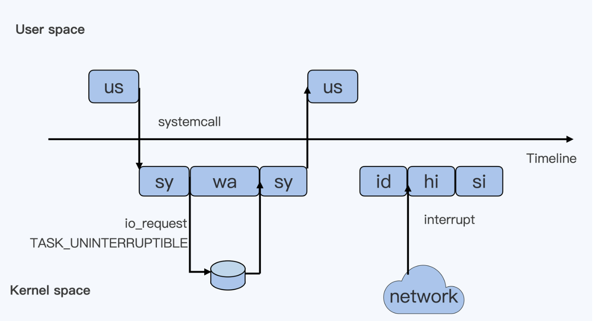

# 容器中的CPU限制
由于容器本质是对进程的隔离，那么理解操作系统对CPU的一些监控和限制将会有助于理解对容器CPU的限制。先看下CPU的各项指标。

us: 用户态时间
sys: 内核态时间
ni: 不怎么清楚 应该是进程运行的优先级！！
id: idle 系统空闲时间 
wa: iowaiting，等待系统IO，时间不计入CPU
hi: 硬中断  不计入CPU
si: 软中断  不计入CPU
st: steal 同一宿主机上其他cpu抢走的时间

cgroup是对进程资源做限制的，那么要对cpu资源做出限制的 cpu cgroup 了。那么前面可以看到内核态的us ni
和 sys是进程运行在cpu的关键时间，所以cpu cgroup也需要对他们作出限制就ok了。
每个cpu cgroup挂在到虚拟文件系统上