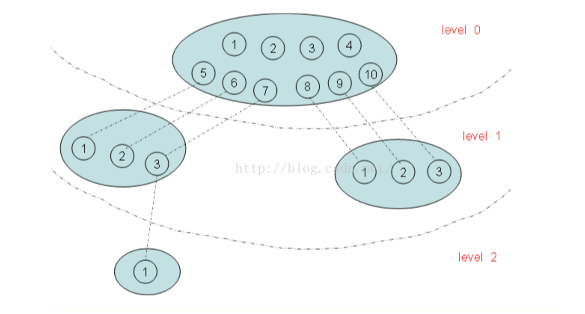

# NameSpace机制探究
NS机制涉及过多，先从进程模块开始。进程在Linux中的表现形式是一个task结构体。
```C
struct task_struct {
    pid_t pid;    // 全局唯一 
    pid_t tgid;   // 全局唯一
    ......
    /* namespaces */
    struct nsproxy *nsproxy;
    ......
}
```
保存的是一个nsproxy指针，长这样
```C
struct nsproxy {
	atomic_t count; // 关联该结构体的task_struct数量
	struct uts_namespace *uts_ns; //uts命名空间
	struct ipc_namespace *ipc_ns; //ipc命名空间
	struct mnt_namespace *mnt_ns; //mnt命名空间
	struct pid_namespace *pid_ns; //pid命名空间
	struct net 	     *net_ns; //网络相关的命名空间的数量
}
```
这里需要注意，如果一个命名空间不一致或者新的命名空间产生，nsproxy将会重新copy一份。
PID命名空间是按照层次组织的，当我们在新复制一个进程时，都会设置是否新建一个命名空间的标志位。新建的命名空间中的所有PID对父命名空间都是可见的，但是子命名空间却无法看到父命名空间。为什么会这样呢，原来在建立新的命名空间的时候，新命名空间的所有PID都会在父命名空间建立一个它的映射，有了这个映射，父命名空间就可以看到子命名空间的PID啦。父子命名空间的层次结构图如下：



这种层级可以看到有2种id，一种全局，一种局部。
全局id就是PID，唯一性。在task_struct中pid，tgid是唯一的。
局部ID：只属于一个命名空间，其局部ID也只有在该命名空间里面有效。
从这里也可以看出这个这个is_global_init()函数判断的是全局id唯一性

```C
// sched.h
static inline int is_global_init(struct task_struct *tsk)
{
	return task_tgid_nr(tsk) == 1;
}

// 这里_nr后缀代表number？ 还是 number reference？
static inline pid_t task_tgid_nr(struct task_struct *tsk)
{
	return tsk->tgid;
}
```

既然直接展示的是pid， tgip，那么在进程在不同命名空间中呈现不同的pid又是怎么样实现的呢？
看下linux的解决思路
```C
// 一个小技巧，前三个是PID_TYPE，最后代表TYPE的个数，这样根据enum性质推出TYPE个数。
// 以后即使要添加种类也不需要大改代码！ 优雅，真的优雅！！！
// 以下的类型都是namespace下的，别和全局id pid_t 搞混了，pid_t就是个整数类型（具体得从源码确定）
enum pid_type
{
    PIDTYPE_PID,   // PID 
    PIDTYPE_PGID,  // PGID 进程组编号
    PIDTYPE_SID,   // SID  会话组编号
    PIDTYPE_MAX
};

struct upid {
    int nr;
    struct pid_namespace *ns;
    struct hlist_node pid_chain;
};

struct pid
{
    atomic_t count;
    /* 使用该pid的进程的列表 */
    struct hlist_head tasks[PIDTYPE_MAX];
    int level;
    struct upid numbers[1];
};
```


