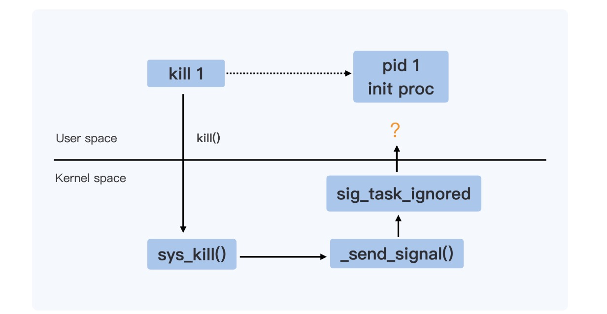
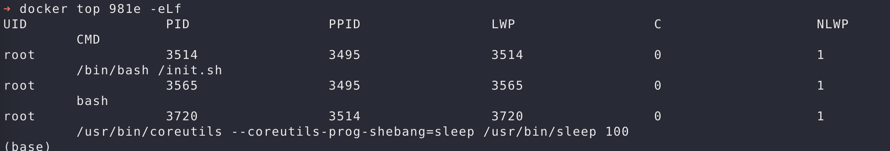

# Docker进程
Docker的隔离是建立在操作系统的namesapce机制上的，而进入都namespace中初始化一个操作系统需要一个1号进程，容器的init进程就是这个1号进程。
这个程序需要执行的第一个**用户态程**就是 init 进程。
既然是一个进程，那么就会对信号进行响应，那么为什么有的时候容器对一个kill所发出的信号没有反应呢？
linux中信号很多，重点对**SIGTERM（15）和 SIGKILL（9）**这2个信号进行分析。

## 进程对信号的反应
* ignore
对信号不做任何反应，2个特权信号除外 SIGKILL & SIGSTOP
SIGKILL：杀死进程
SIGSTOP：停止进程

* catch
用户自己注册对信号的处理，上述的2个特权信号除外。类似Java的catch机制？

* default
内核默认的处理信号的行为

## 信号处理过程


主要的判断逻辑在 sig_task_ignored() 函数中
```c
// kernel/signal.c
static bool sig_task_ignored(struct task_struct *t, int sig, bool force)
{
        // 0 false 1 true
        void __user *handler;
        handler = sig_handler(t, sig);

        /* SIGKILL and SIGSTOP may not be sent to the global init */
        if (unlikely(is_global_init(t) && sig_kernel_only(sig)))
                return true;

        if (unlikely(t->signal->flags & SIGNAL_UNKILLABLE) &&
            handler == SIG_DFL && !(force && sig_kernel_only(sig)))
                return true;

        /* Only allow kernel generated signals to this kthread */
        if (unlikely((t->flags & PF_KTHREAD) &&
                     (handler == SIG_KTHREAD_KERNEL) && !force))
                return true;

        return sig_handler_ignored(handler, sig);
}
```
PS: 这里的unlikely函数是一宏指令与likely正好相反，用来编译器优化的。使用likely ，执行if后面语句的可能性大些，编译器将if{}是的内容编译到前面, 使用unlikely ，执行else后面语句的可能性大些,编译器将else{}里的内容编译到前面。这样有利于cpu预取,提高预取指令的正确率,因而可提高效率。

is_global_init()的函数 Check if a task structure is the first user space task the kernel created. (判断第一个用户态的进程？) --> 这里的判断涉及namespace吗，是宿主机的初始进程还是docker容器里面的初始进程？如果是宿主机的初始进程，那么Docker中执行的命令会以怎么样的形式传送(用什么工具追踪呢？)。

这里的t是kill程序还是被kill进程，还是kill进程？从函数上来开应该是被kill的进程

### 额外插入 关于 ps 命令的显示线程
```shell
# ps -eLf 
UID        PID  PPID   LWP  C NLWP STIME TTY          TIME CMD
root         1     0     1  0    1 13:56 ?        00:00:00 /bin/bash /init.sh
root         8     0     8  0    1 13:56 pts/0    00:00:00 bash
root        34     1    34  0    1 14:13 ?        00:00:00 /usr/bin/coreutils --coreutils
root        36     8    36  0    1 14:14 pts/0    00:00:00 ps -eLf
```
加入参数 -L ， Show threads, possibly with LWP and NLWP columns. 显示相关的信息。
其中 LWP: thread ID   NLWP: number of threads

那么在宿主机中可以查看到真实的容器进程号吗？可以的
```shell
# 宿主机中执行
# docker ps 容器ID 【ps参数】
# docker ps abcd -eLf 
```

可以看到实际的PID一个是3514，一个是3565

## 困惑？
进入？ 是指执行exec命令 还是 run 以后  run以后什么都不输入呢？
为什么会有2个0号进程？
如果
如果执行的是exec的不同命令呢？那么父亲命令是什么？
