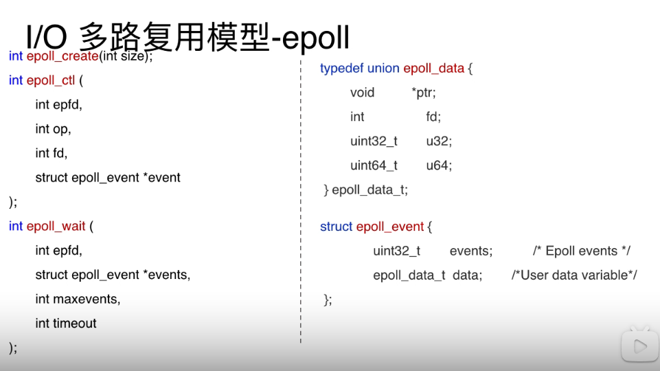

# epoll

流程结合代码理解一下。
首先通过epoll_create在**内核**创建红黑树和一个就绪队列（就绪队列里面存放有数据过来的socket，这里用socket距离）。
epoll_ctl 插入需要监听的对象
epoll_event 用户态中用来看需要操作的socket。内核会把就绪队列的socket拷贝到epoll_event中

那么epoll的优点
fd数量没上限制，基于红黑树
事件来了以后，不用On的复杂度，只需要O1，因为事件都被提取到就绪队列中了

那么问题来了，红黑树里面的节点如何知道事件发生，并转到就绪队列中呢？
