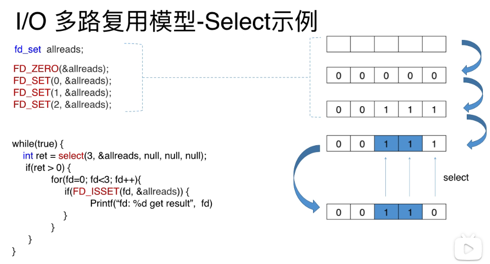

# select机制解析
```c
int select(
    int maxfdp1,     // 当前文件描述符最大值 + 1，确定扫描范围，减少开销
    fd_set *readset, // 读 fd 集合
    fd_set *writeset, // 写 fd 集合
    fd_set *exceptset, // 异常 fd 集合
    const struct timeval *timeout // 超时时间
);

// 相关宏
void FD_ZERO(fd_set *fdset);           
//清空集合

void FD_SET(int fd, fd_set *fdset);   
//将一个给定的文件描述符加入集合之中

void FD_CLR(int fd, fd_set *fdset);   
//将一个给定的文件描述符从集合中删除

int FD_ISSET(int fd, fd_set *fdset);   
// 检查集合中指定的文件描述符是否可以读写 1 可读写 0 不可读写
```
select最终返回
0 -- 超时
-1 -- error
ready_fd 准备好的fd个数



图中先把fd_set中的0，1，2位设置为1
再调用select函数。然后返回准备好的fd数量
这里有个地方需要注意，如果fd_set中没有数据，则fd_set对应的位会被变成0（**不可重用**）

所以fd_set在每次轮询的时候都得重新设置一遍！！！
fd_set默认支持1024个
还是需要把fd_set拷贝到内核，再从内核拷贝回来
每次都需要On复杂度的查询


可以看出在select中，线程是阻塞的
