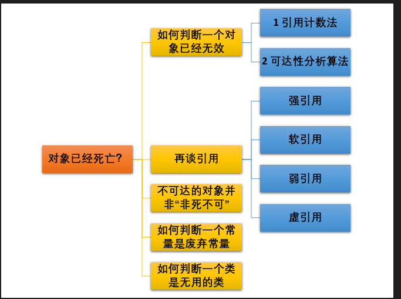

# Java内存理解
## 线程私有
1、PC寄存器，指向当前运行的指令
2、虚拟机栈和本地方法栈（native好理解一点因为本质上是用c写的代码），感觉实际上没多大差别。都是方法的调用后产生的成员变量的栈帧。Hotspot将2个合在了一起

## 线程共享
1.8以后只有堆了，是内存中最大的区域。
堆被分为了3个区域（**为了优化GC性能**）
* 新生代
* 老年代
* 元空间 （特别注意的点）

### 新生代 （minor）
新生代还被分为了3个部分，Eden，S0还有S1。默认比例8：1：1
一次 minor GC 后，Eden对象存活进入S0 or S1中。（这是一个反复的过程，S0到S1或者S1到S0，不会出现S0和S1都有对像的情况）。
当幸存的对象超过一定岁数后，会升级进入老年代。

### 老年代 （major）
通常，垃圾收集是在老年代内存满时执行的。老年代垃圾收集称为 主GC（Major GC），通常需要更长的时间。
大对象直接进入老年代，防止频繁的内存移动

### 元空间
元空间只是方法区（JVM规范）的一种实现，同时元空间被放置在本地内存（堆外内存），不受GC控制。以前是放在运行时区域，容易发生Out of memory。

### 对象在堆中的生命周期
1、创建的对象（较小的对象）分配到Eden区，会被赋予对象年轻计数器（理解为岁数）-XX:MaxTenuringThreshold
2、Eden空间不足，JVM执行 Minor GC，JVM会把存活对象转到Survivor中，岁数+1，在Survivor中也会经历Minor GC，岁数+1
3、岁数超过 -XX:PetenureSizeThreshold 后，直接分配到老年区

遗留问题：如果Survivor区满了怎么办?
有可能当次 Minor GC 后，Survivor 的"From"区域空间不够用，有一些还达不到进入老年代条件的实例放不下，则放不下的部分会提前进入老年代

### 如何利用 runtime api 进行计算堆空间

## GC 杂谈
新生代收集（Minor GC/Young GC）：只是新生代的垃圾收集
老年代收集（Major GC/Old GC）：只是老年代的垃圾收集
目前，只有 CMS GC 会有单独收集老年代的行为 很多时候 Major GC 会和 Full GC 混合使用，需要具体分辨是老年代回收还
是整堆回收 混合收集（Mixed GC）：收集整个新生代以及部分老年代的垃圾收集
目前只有 G1 GC 会有这种行为 整堆收集（Full GC）：收集整个 Java 堆和方法区的垃圾

### 对象的死亡

#### 引用计数法
给对象中添加一个引用计数器，每当有一个地方引用它，计数器就加 1；当引用失效，计数器就减 1；任何时候计数器为 0 的对象就是不可能再被使用的。
会有循环引用的问题 

#### 可达性分析
这个算法的基本思想就是通过一系列的称为 “GC Roots” 的对象作为起点，从这些节点开始向下搜索，节点所走过的路径称为引用链，当一个对象到 GC Roots 没有任何引用链相连的话，则证明此对象是不可用的。 

可作为 GC Roots 的对象包括下面几种: 虚拟机栈(栈帧中的本地变量表)中引用的对象 本地方法栈(Native 方法)中引用的对象 方法区中类静态属性引用的对象 方法区中常量引用的对象 所有被同步锁持有的对象

### GC 算法

### 引用分类
#### 强引用
必不可少的生活用品，垃圾回收器绝不会回收它。当内存空间不足，Java 虚拟机宁愿抛出 OutOfMemoryError 错误，使程序异常终止，也不会靠随意回收具有强引用的对象来解决内存不足问题。
#### 软引用
可有可无的生活用品。如果内存空间足够，垃圾回收器就不会回收它，如果内存空间不足了，就会回收这些对象的内存。只要垃圾回收器没有回收它，该对象就可以被程序使用。软引用可用来实现内存敏感的高速缓存。
#### 弱引用
只具有弱引用的对象拥有更短暂的生命周期。在垃圾回收器线程扫描它所管辖的内存区域的过程中，一旦发现了只具有弱引用的对象，不管当前内存空间足够与否，都会回收它的内存。收集就完事了。
#### 虚引用
"虚引用"顾名思义，就是形同虚设，与其他几种引用都不同，虚引用并不会决定对象的生命周期。如果一个对象仅持有虚引用，那么它就和没有任何引用一样，在任何时候都可能被垃圾回收。
