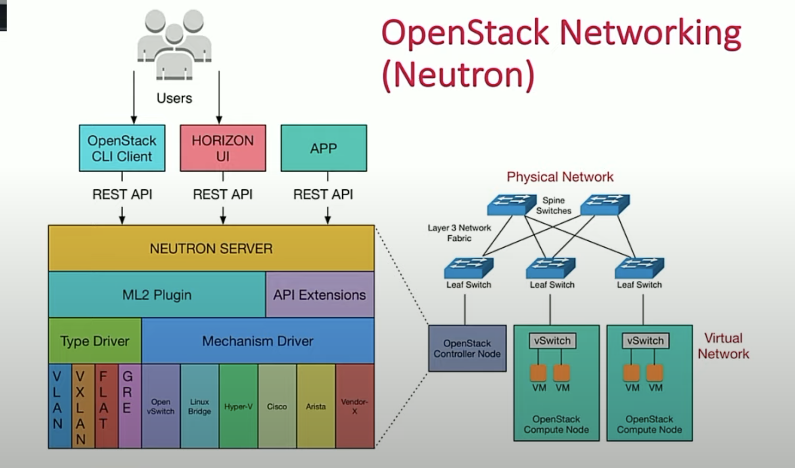

# Neutron 基本架构和组成
## Neutron的实质
Neutron的实质是一个网络管理面工具，所谓的管理面工具指的是他不直接参与网络虚拟化的实现。他所做的工作本质上是根据 api 调用相应的虚拟化组件来进行网络的虚拟化。例如调用 openswitch 创建网桥，端口等操作。

## Neutron的组成

## VID转换
其中本地网络层通过 VLAN ID 来划分 br-int 中处于不同网络的虚拟机（端口），本地网络仅支持 VLAN 类型；而租户网络层为了实现多类型混合平面的需求却要支持非隧道类型网络 Flat、VLAN（br-ethX）及隧道类型网络 VxLAN、GRE（br-tun）。显然，本地网络层和租户网络层之间必须存在一层转换。这就是所谓的 VID 转换。

从本地混合到各种隧道类型的转换