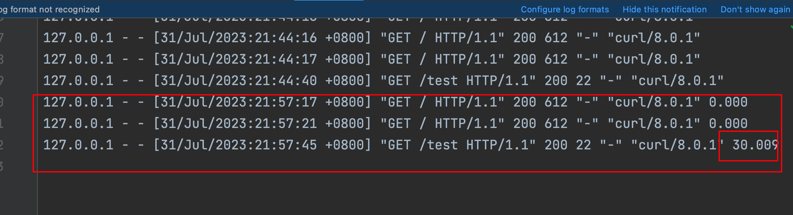

```python
#%%
from http.server import BaseHTTPRequestHandler, HTTPServer
import time

class MyHandler(BaseHTTPRequestHandler):
    def do_GET(self):
        self.send_response(200)
        self.send_header('Content-type', 'text/html')
        self.end_headers()
        message = 'Hello world!'
        time.sleep(30)
        self.wfile.write(bytes(message, 'utf-8'))
    
    def do_POST(self):
        # 获取POST请求的内容长度
        content_length = int(self.headers.get('Content-Length', 0))
        
        # 读取POST请求的内容
        post_data = self.rfile.read(content_length)
        
        # 将POST请求的内容作为字符串输出到控制台
        print(post_data.decode('utf-8'))
        
        # 返回响应
        self.send_response(200)
        self.send_header('Content-Type', 'text/plain; charset=utf-8')
        self.end_headers()
        self.wfile.write('Thanks for the POST request!'.encode('utf-8'))

if __name__ == '__main__':
    server_address = ('', 8080)
    httpd = HTTPServer(server_address, MyHandler)
    print('Starting HTTP server on port 8080...')
    httpd.serve_forever()
```

1. 测试场景1，转发到一个后端sleep 30s




2. 