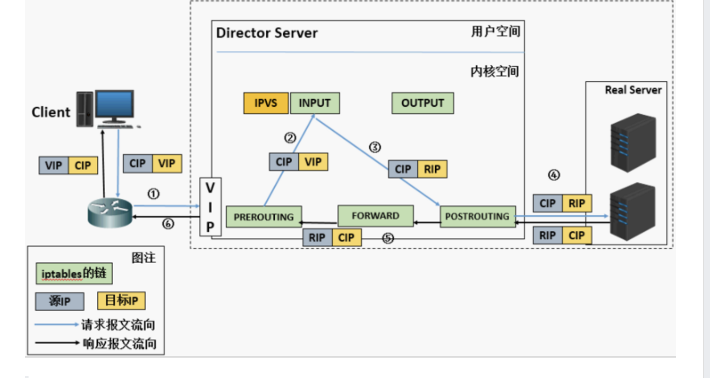

# lvs 初步认识
## NAT模式
这个模式下感觉就是拿lvs当网关，从客户端到服务器，入方向做了个DNAT，到实际的服务器，先经过preforward -> input (这里搞了DNAT)

然后回包的时候会经过SNAT，把后端的源ip改为lvs上的vip，可以看到这个forward链是有用的，是否意味着必须在同一网段？待确认
具体限制：
（1）RIP和DIP必须在同一个IP网络，且应该使用私网地址；RS的网关要指向DIP；
（2）请求报文和响应报文都必须经由Director转发；Director易于成为系统瓶颈；
（3）支持端口映射，可修改请求报文的目标PORT；

## DR模式
主要是修改MAC地址，因为lvs服务器和后端服务器是同一网段的，那就基于二层通信了。但是ip不一样咋整呢？ 
主要困惑在这：
RS发现请求报文的MAC地址是自己的MAC地址，就接收此报文。处理完成之后，将响应报文通过lo接口传送给eth0网卡然后向外发出。 此时的源IP地址为VIP，目标IP为CIP

好像一个网卡 2个 ip？？？ 可以的

DR（Direct Routing 直接路由模式）此模式时LVS 调度器只接收客户发来的请求并将请求转发给后端服务器，后端服务器处理请求后直接把内容直接响应给客户，而不用再次经过LVS调度器。LVS只需要将网络帧的MAC地址修改为某一台后端服务器RS的MAC，该包就会被转发到相应的RS处理，注意此时的源IP和目标IP都没变。RS收到LVS转发来的包时，链路层发现MAC是自己的，到上面的网络层，发现IP也是自己的，于是这个包被合法地接受，RS感知不到前面有LVS的存在。而当RS返回响应时，只要直接向源IP（即用户的IP）返回即可，不再经过LVS。

## 下一步计划
可以尝试搭几个服务器看看

## ref
https://segmentfault.com/a/1190000020288049
https://wsgzao.github.io/post/lvs-keepalived/   