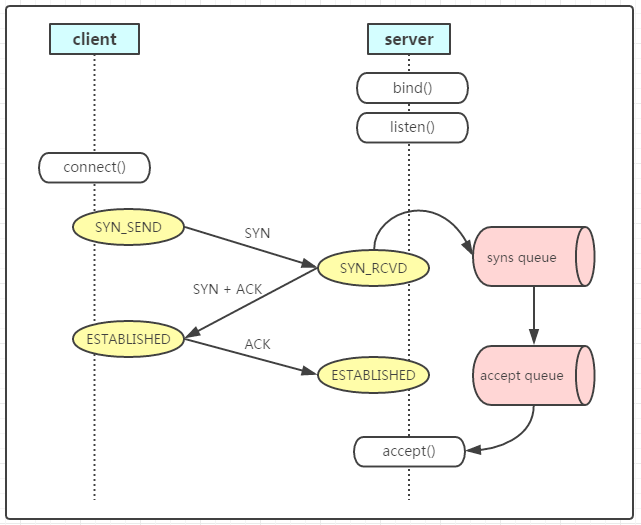

# 2个队列的作用和可能带来的问题
1. BSD的实现
一个Queue能够包含两种状态的Connections：

SYN RECEIVED
ESTABLISHED
只有ESTABLISHED状态的Connection才能被应用通过syscall accept()方法获取到。

因此，该队列的长度由listen()的参数backlog决定。

2. linux的实现
一个SYN Queue 和 一个Accept Queue
这种情况下，处于SYN RECEIVED状态的connection将会被添加到SYN queue，然后当连接状态变成ESTABLISHED时再把其移动到Accept queue中。

因此，Accept queue只存储等待accept()调用的connection。

不像前一个示例，linsten() syscall的参数backlog此时决定了Accept queue的大小。



主要带着以下几个点去探索，由什么决定大小，容量满了linux内核的行为，以及各种内核参数的影响，和日志或者命令可以体现出容量达到上限，

## syn-queue
syn-queue，接受了客户端发的syn后进入到syn-queue。syn-queue的长度会和这个系数有关。
```shell
# 待验证
cat /proc/sys/net/ipv4/tcp_max_syn_backlog 
sysctl -a | grep tcp_max_syn_backlog
```
这个参数还是有点问题的。。。具体看内核实现，大多数是2的幂次方。（需要再次确认的）
如果这个队列被打满了，linux内核会发什出么，发出的包和什么内核参数有关？
如果syn-queue队列满了，那么内核会丢弃这个握手的包（抛开tcp_syncookies的角度来看），而不会返回什么（这是服务端的行为，客户端呢？重试，重试次数上限了就pass？）
还有个参数可以影响这个syn-queue行为，**tcp_syncookies**。这个是用来防御**SYN Flood attack**的。（这个实在是太复杂了，搞不定，先pass掉）。
大致来说：
开启 syncookies 功能就可以在不使用 SYN 半连接队列的情况下成功建立连接。syncookies 是这么做的：服务器根据当前状态计算出一个值，放在己方发出的 SYN+ACK 报文中发出，当客户端返回 ACK 报文时，取出该值验证，如果合法，就认为连接建立成功。
0 值，表示关闭该功能；
1 值，表示仅当 SYN 半连接队列放不下时，再启用它；
2 值，表示无条件开启功能；

### 如何使用命令来看这个syn-queue的溢出
```shell
netstat -s | grep "SYNs to LISTEN"
```
通过反复执行这个命令确定数字上涨来看。


## ref
https://imroc.cc/kubernetes/troubleshooting/network/close-wait-stacking.html